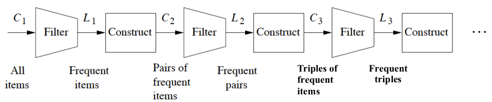

# discovery-of-frequent-itemsets-and-association-rules

## Setup

Make a conda virtual environment from the ```environment.yml``` file as discussed [here](https://docs.conda.io/projects/conda/en/latest/user-guide/tasks/manage-environments.html). Make the virtual environment available in Jupyter Notebooks as discussed [here](https://stackoverflow.com/questions/39604271/conda-environments-not-showing-up-in-jupyter-notebook). Start Jupyter Notebooks and select the environment. Run the ```main.ipynb``` notebook.

## Reproducibility

There is no randomness or stochasticity involved.

## Data

The data is located at ```data/T10I4D100K.dat```, and includes rows (representing baskets of items) as shown below:

```
25 52 164 240 274 328 368 448 538 561 630 687 730 775 825 834 
39 120 124 205 401 581 704 814 825 834 
35 249 674 712 733 759 854 950 
39 422 449 704 825 857 895 937 954 964 
15 229 262 283 294 352 381 708 738 766 853 883 966 978 
26 104 143 320 569 620 798 
7 185 214 350 529 658 682 782 809 849 883 947 970 979 
227 390 
71 192 208 272 279 280 300 333 496 529 530 597 618 674 675 720 855 914 932 
183 193 217 256 276 277 374 474 483 496 512 529 626 653 706 878 939 
161 175 177 424 490 571 597 623 766 795 853 910 960 
125 130 327 698 699 839 
392 461 569 801 862 
```

## Goal

Discover frequent itemsets with the Aprioir algorithm (from [Fast Algorithms for Mining Association Rules](http://www.vldb.org/conf/1994/P487.PDF)).
Find association rules based on the frequent itemsets. The association rules are of the form with confidence:

I -> j where conf(I -> j) = support(I union j) / support(I)

where I union j are frequent itemset (and there I and j are too).

The Apriori algorithm.



## Results

With a support of 1% (occurence of itemsets at least in 1000 baskets, since there are 10k baskets) and a confidence threshold of 50%, the following non-singleton frequent itemsets and association rules are discovered:

```
frequent itemset: {368, 829}

frequent itemset: {722, 390}

frequent itemset: {789, 829}

frequent itemset: {704, 825}
	association rule: {704} -> {825} with confidence=0.6143

frequent itemset: {704, 39}
	association rule: {704} -> {39} with confidence=0.6171

frequent itemset: {227, 390}
	association rule: {227} -> {390} with confidence=0.5770

frequent itemset: {368, 682}

frequent itemset: {217, 346}

frequent itemset: {825, 39}

frequent itemset: {704, 825, 39}
	association rule: {704} -> {825, 39} with confidence=0.5769
	association rule: {704, 825} -> {39} with confidence=0.9392
	association rule: {704, 39} -> {825} with confidence=0.9350
	association rule: {825, 39} -> {704} with confidence=0.8719
```
